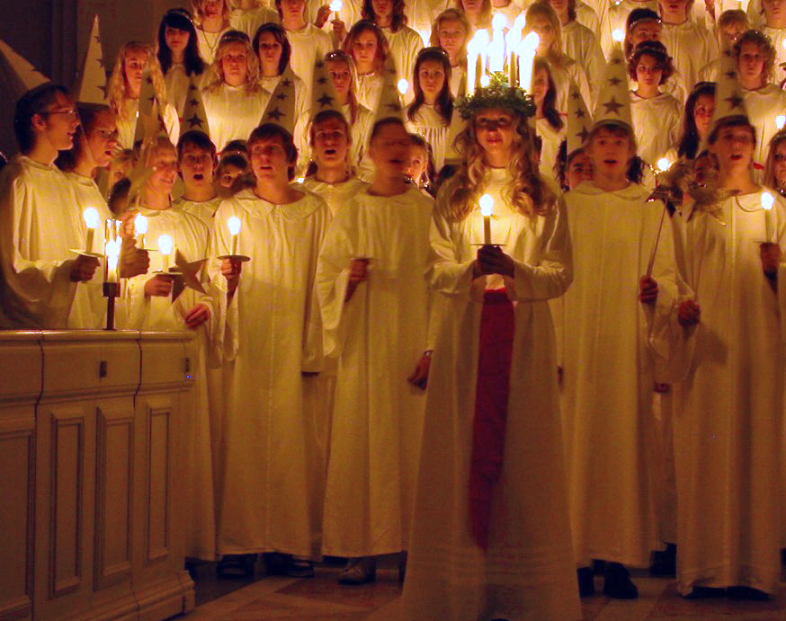
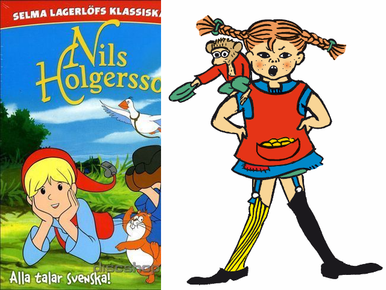

:css: css/slides.css
:skip-help: true

.. title: Szwecja

----

Szwecja
=======

----

Święta Bożego Narodzenia w Szwecji nie wyglądaja tak samo jak w Polsce.

W dniu Świetej Łucji (13-go grudnia) jeden z domowników ubiera się w
strój Świętej Łucji i budzi wszystkich pozostałych śpiewając
tradycyjną pieśn Świętej Łucji.

----

.. image:: images/tomten.jpg
    :height: 480px

W Szwecji Święty Mikołaj nie odwiedza dzieci w dniu Świętego Mikołaja,
ale przychodzi do nich dopiero w Wigilię, puka do drzwi i pyta " czy są
tutaj grzeczne dzieci ?" Tylko grzeczne dzieci dostają prezenty.

Mikołaj w Szwecji  jeździ na reniferze alba na kozie!

----

.. image:: images/Julbord.jpg
    :height: 480px

W Wigilię w Szwecji jest prawdziwy szewdzki stół, na stołach jest
mnóstwo jedzenia, a każdy może spróbować wszystkiego po trochu. Jest
ogromna szynka, różnego rodzaju śledzie i oczywiście mięsne pulpety.

Jest też dużo ryb ale nie ma karpia.

----

Szwedzkie jedzenie jest podobne do polskiego, zamiast bigosu jest pyttipanna,
w której zamiast kapusty są ziemniaki. W Szwecji są tak jak w Polsce
mięsne pulpety no i oczywiscie różnego rodzaju śledzie.

----

Szwedzi maja również placki ziemniaczane, kluski, knedle z mięsem ale
najważniejsze - Szwedzi kochają kiełbasę.

----

Flaga Szwecji to żółty krzyż na ciemno - niebieskim tle.

----

Szwecja to bardzo długi kraj. Południe Szwecji jest blisko Polski, pogoda w
tym rejonie jest prawie taka sama jak u nas, ale na północy lato jest
bardzo krótkie a zima jest bardzo długa i bardzo zimna.

----

Na samym "czubku" Szwecji w czerwcu słońce nigdy nie zachodzi, a w
okolicach Świąt Bożego Narodzenia słońce nigdy nie wschodzi.

Pojawiają się za to piękne światła na niebie zwane : "Światłami Północy".

----

.. image:: images/vikings.JPG
    :height: 480px

Szwecja jest ojczyzną Wikingów, ludności która handlowała i walczyła na
terenie całej Europy.

Wikingowie ochraniali cesarza Bizantium jak i podbili Anglię i założyli
Rosję.

----

Czasami Polska i Szwecja miały wspólną historię. Mieliśmy wspólnego
króla o imieniu Zygmunt. Pochodził on ze Szwecji, został wybrany na króla
Polski ponieważ jego mama była Polską księżniczką , która wyszła za
mąż za Szwedzkieg króla.

----

Szwecja znana jest takżę z dobrych książek dla dzieci takich jak Cudowna
podróż czy Pippi Pończoszanka.

----

Teraz jednak Szwecja najbardziej znana jest ze sklepu IKEA.
